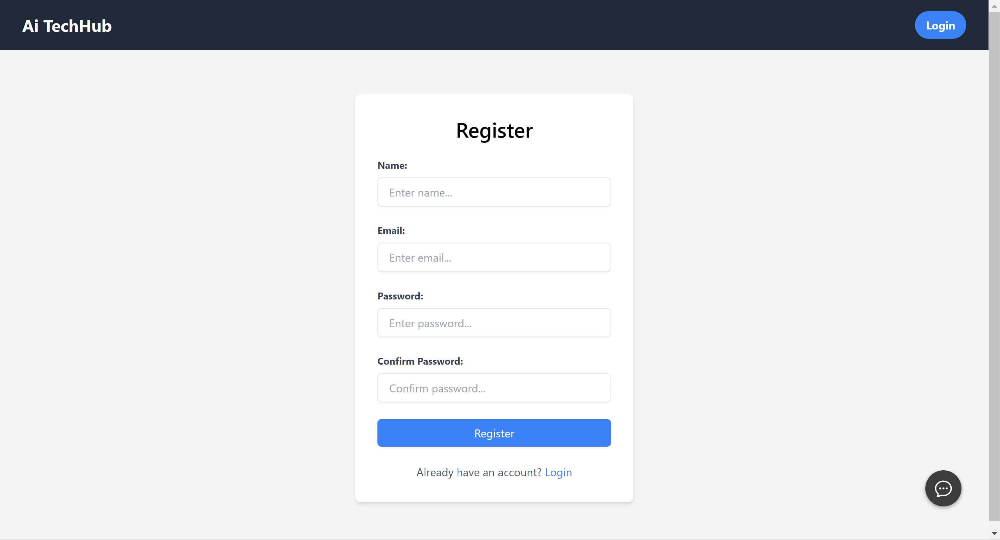

# Ai Techhub

## 84 Ai based It training system
## CODS204 CODE OFF DUTY
"AiTech Hub offers a comprehensive platform for AI and technology education, catering to both beginners and experienced enthusiasts. Embark on a journey of discovery and innovation with AiTech Hub's curated resources and tailored learning experiences."


## Screenshots




## Key Features 
- Personalized Learning: Tailored learning plans based on your knowledge and needs.
- Interactive Lessons: Engaging videos, animations, and exercises for enhanced learning.
- Feedback and Assistance: Get hints and tips when you're stuck, fostering independent learning.
<!-- - Progress Tracking: Monitor your learning journey and identify areas for improvement. -->
- Continuous Improvement: System evolves over time, optimizing teaching methods based on user feedback.
- Ai powered Bot
- Fully responsive
- Fully Functional Application


## Lessons Learned
We delved into backend authentication and explored AI, broadening our web development expertise.
## Tech Stack

**Client:** React, Redux, TailwindCSS

**Server:** Node, Appwrite Service as a Backend


## Run Locally

Clone the project

```bash
  git clone https://github.com/smartcraze/Ai-Techhub
```

Go to the project directory

```bash
  cd my-project
```

Install dependencies

```bash
  npm install
```

Start the server

```bash
  npm run dev
```


## Running Tests

To run tests, run the following command

```bash
  npm run test
```
# You can Interact With Ai Bot


